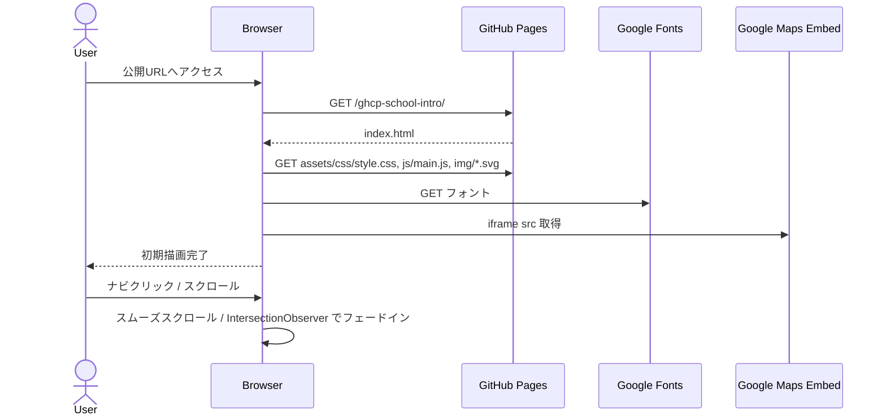

# Design: 神山まるごと高専 紹介ページ (インド味LP)

## 1. 実行戦略

- Confidence Score 88% (High Confidence) のため、PoC は省略し全工程を一括で実装する。
- ビルドツールを使わず、ブラウザ直読みで動作する素のHTML/CSS/JSで構成する。

## 2. アーキテクチャ概要

```
[Browser]
   │  HTTPS GET https://te0814.github.io/ghcp-school-intro/
   ▼
[GitHub Pages CDN]
   │  serves docs/ as web root
   ▼
docs/
 ├ index.html            # 単一ページLP
 ├ .nojekyll             # Jekyll 処理を無効化
 └ assets/
   ├ css/style.css       # テーマトークン + レイアウト + 装飾
   ├ js/main.js          # ナビ開閉, IntersectionObserver
   └ img/                # マンダラ/ペイズリー/アイコン SVG
        ├ mandala.svg
        ├ paisley-divider.svg
        └ icon-*.svg
```

- 外部依存:
  - Google Fonts: `Tiro Devanagari Hindi`, `Noto Sans JP`
  - Google Maps Embed (iframe, APIキー不要の共有埋め込みURL)

## 3. ページ構造とデータフロー

### 3.1 セクション一覧

| 順 | セクション   | id           | 役割                                       |
|----|--------------|--------------|--------------------------------------------|
| 1  | Header       | `#site-header` | サイトロゴ + ナビ(モバイルではハンバーガー) |
| 2  | Hero         | `#hero`      | キャッチコピー、回転マンダラ、CTAボタン      |
| 3  | About        | `#about`     | 学校紹介ダミー文 + ペイズリー装飾           |
| 4  | Features     | `#features`  | 3〜4 枚の特徴カード                         |
| 5  | Curriculum   | `#curriculum`| カリキュラム概要(年次別タイムライン風)     |
| 6  | Access       | `#access`    | 住所テキスト + Google Maps iframe           |
| 7  | CTA          | `#cta`       | 資料請求風ダミーボタン(リンクはダミー)      |
| 8  | Footer       | `#site-footer`| ダミー注記 + コピーライト                  |

### 3.2 ユーザー操作シーケンス



## 4. デザイントークン

CSS変数として `:root` で定義する。

| トークン                | 値                                |
|-------------------------|-----------------------------------|
| `--color-saffron`       | `#FF9933`                         |
| `--color-white`         | `#FFFFFF`                         |
| `--color-green`         | `#138808`                         |
| `--color-navy`          | `#000080`                         |
| `--color-gold`          | `#D4AF37` (アクセント縁取り)     |
| `--color-ink`           | `#1A1A1A` (本文)                 |
| `--color-cream`         | `#FFF7E6` (背景アクセント)       |
| `--font-display`        | `"Tiro Devanagari Hindi", serif` |
| `--font-body`           | `"Noto Sans JP", sans-serif`     |
| `--radius-arch`         | `50% 50% 12px 12px / 60% 60% 12px 12px` |
| `--shadow-soft`         | `0 8px 24px rgba(0,0,0,0.12)`    |
| `--bp-md`               | `768px`                           |
| `--bp-lg`               | `1024px`                          |

## 5. インターフェース仕様

### 5.1 HTML 構造の主要部分

- `<html lang="ja">`
- `<head>`:
  - `meta charset, viewport, description`
  - OGP最低限(`og:title`, `og:description`, `og:type=website`)
  - Google Fonts `<link>`
  - `<link rel="stylesheet" href="assets/css/style.css">`
- `<body>`:
  - `<header id="site-header">` → ロゴ + `<nav>`(`<button class="nav-toggle">` を含む)
  - `<main>` 内にセクションを並べる
  - `<footer id="site-footer">`
  - `<script src="assets/js/main.js" defer></script>`

### 5.2 JS API (`main.js`)

- 公開関数なし(IIFE で内部完結)
- 役割:
  - `initNavToggle()`: `.nav-toggle` クリックで `<nav>` の `aria-expanded` と `data-open` をトグル
  - `initScrollReveal()`: `IntersectionObserver` で `.reveal` 要素に `is-visible` を付与
  - `initSmoothScroll()`: ブラウザネイティブ `scroll-behavior: smooth` をCSSで担保し、JSではフォーカス移動補助のみ
  - `respectReducedMotion()`: `matchMedia('(prefers-reduced-motion: reduce)')` を見て observer 適用をスキップ

### 5.3 CSS 設計

- BEM風の軽い命名(`.card`, `.card__title`, `.card--feature` 等)
- レイアウトは CSS Grid と Flexbox を併用
- `prefers-reduced-motion` メディアクエリで `animation: none` を上書き

## 6. 装飾モチーフ実装方針

| モチーフ              | 実装                                                                 |
|-----------------------|----------------------------------------------------------------------|
| マンダラ              | インラインSVG or `img/mandala.svg`、`@keyframes spin` で回転        |
| ペイズリーディバイダー | `img/paisley-divider.svg`、各セクション先頭に配置                   |
| Mughal アーチボタン   | `border-radius: var(--radius-arch)`、金縁 `border: 2px solid var(--color-gold)` |
| カード縁取りパターン  | SVG を `background-image` でリピート                                |
| 挨拶文 "ナマステ"     | Hero に `<span class="greeting">नमस्ते</span>` を装飾配置             |

## 7. データモデル

- 永続データなし。すべてHTMLにハードコードしたダミーテキスト。

## 8. エラーマトリクス

| 事象                              | 検出                    | 期待挙動                                        |
|-----------------------------------|-------------------------|-------------------------------------------------|
| JS 無効                           | -                       | 全コンテンツ閲覧可能。ナビは常時展開で表示      |
| IntersectionObserver 非対応       | feature detection       | 全 `.reveal` 要素に初期から `is-visible` を付与 |
| Google Fonts 読込失敗             | font-display: swap      | システムフォントで表示                          |
| Maps iframe ブロック              | -                       | 周辺の住所テキストで所在地を案内                |
| 画像 (SVG) 読込失敗               | -                       | レイアウトが崩れないように `min-height` を確保  |
| reduced-motion 設定               | media query             | アニメーション停止                              |

## 9. アクセシビリティ

- ランドマーク: `header`, `nav`, `main`, `footer` を使用。
- ナビトグル: `<button>` に `aria-expanded`, `aria-controls`, `aria-label` を設定。
- 装飾SVG: `aria-hidden="true"` または `role="presentation"`。
- iframe: `title` 属性で「神山町周辺地図」と明示。

## 10. テスト戦略

- 自動テスト: 導入しない(静的ページのため)。
- 手動チェックリスト:
  1. ローカル `python3 -m http.server 8000 --directory docs` で全セクション表示
  2. DevTools のレスポンシブモード(375 / 768 / 1280px)で崩れなし
  3. Lighthouse でアクセシビリティ 90+ を目安に確認
  4. `prefers-reduced-motion` ON 時にアニメーション停止
  5. Google Maps iframe が表示される
  6. 全 asset が相対パスで 200 を返す
- 公開後検証:
  1. 公開URLで初回表示
  2. ハードリロードで CSS/JS のキャッシュ反映確認

## 11. デプロイ

- main ブランチへ push → GitHub Settings → Pages で
  - Source: `Deploy from a branch`
  - Branch: `main`, Folder: `/docs`
- 反映待機後、公開URLにアクセスして確認。

## 12. 決定記録 (Decision Records)

### Decision - 2026-04-22T00:00:00Z
- **Decision**: 公開方式を「main + /docs」とする
- **Context**: 静的ファイルのみで完結し、ビルド工程不要
- **Options**:
  - A. main + /docs (採用): 設定が最小、PR差分が見やすい
  - B. main ルート公開: README 等の公開を避けたい
  - C. GitHub Actions: 過剰、ビルド産物がない
- **Rationale**: ビルド産物がないため A が最小コスト。プロジェクトファイルとサイト資産を `docs/` で物理的に分離できる
- **Impact**: 公開対象が `docs/` 配下に限定される
- **Review**: ビルドツール導入時に再評価

### Decision - 2026-04-22T00:00:01Z
- **Decision**: 技術スタックを素のHTML/CSS/JS にする
- **Context**: コンテンツ量が少なく、ビルドのメリットより設定コストが上回る
- **Options**:
  - A. 素のHTML/CSS/JS (採用)
  - B. Astro + GitHub Actions
  - C. Jekyll
- **Rationale**: 学習デモ用途で依存ゼロが最適。Pages との相性も良い
- **Impact**: コンポーネント分割やテンプレ機能は使えない。重複は手動管理
- **Review**: ページ数が増えたら B/C を再検討

### Decision - 2026-04-22T00:00:02Z
- **Decision**: 神山まるごと高専のロゴ・写真は使わず、自作 SVG と CSS 装飾のみで構成
- **Context**: 著作権リスク回避と、ダミー紹介サイトという位置付け
- **Options**: A. 自作のみ(採用) / B. 公式素材使用(却下)
- **Rationale**: 権利的にクリーン。インド味の表現は装飾モチーフで十分実現可能
- **Impact**: 写真リッチさは劣るが、独自テーマの自由度は高い
- **Review**: 公式から素材使用許諾を得られた場合に再検討
